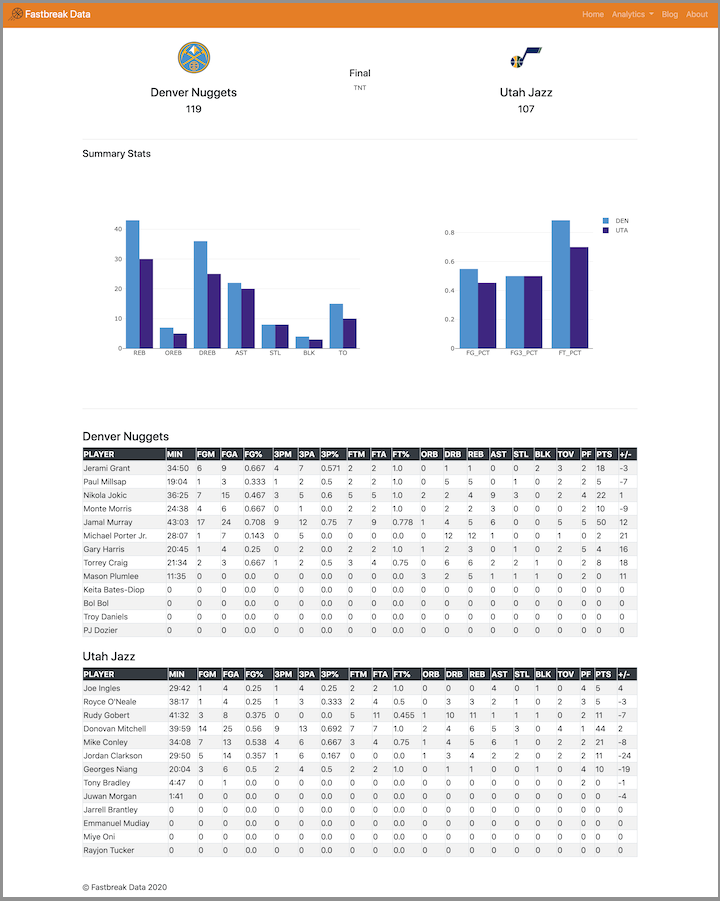

## Udacity Data Scientist Nanodegree

### Capstone Project - Fastbreak Data | NBA Data Dashboard

#### Table of Contents
1. [Overview](#summary)
2. [Data and Metrics](#metrics)
3. [Results](#results)
4. [Conclusion](#conclusion)
5. [Requirements](#requirements)
6. [Installation](#installation)
7. [Credits](#credits)

#### 1. Overview 
This capstone project showcases a NBA data dashboard built using a Python Flask app to display game scores, box scores, and team standings. In addition to the NBA data dashboard, the Flask app also is linked to a technical blog on Medium to share insights and NBA articles with data science applications. This project was intended to be a dashboard to analyze live game results and team analysis. 

The metrics covered here range from team statistics to player statistics. From a team’s perspective, the dashboard analyzes percentages as well as overall counts in key categories such as rebounds, assists, steals, blocks, and turnovers. Looking a player statistics, this dashboard takes into account game performance and displays the counting statistics such as points, rebounds, assists, steals, blocks, turnovers, and plus-minus.

This project is available at [fastbreakdata.herokuapp.com](https://fastbreakdata.herokuapp.com)

**Note:** At the time of this writing, only the local application pulls data as the hosted application shows a ReadTimeout error.

#### 2. Data and Metrics 
The data used in this dashboard uses the [`nbapy`](https://github.com/jtpavlock/nbapy) API to source game information for any specific date. Using a Javascript-enabled date picker, a user can select a date from a dropdown calendar to understand game results, team analysis, and player statistics. 

The Plotly data visualizations included in the box scores illustrate a comparison of two teams in counting statistics (i.e. rebounds, assists, steals, blocks, turnovers) and team percentages (field goal %, free throw %, and 3 point %).

#### 3. Results 

This NBA data dashboard showcased game data and results particularly well in a local environment but struggled to perform as consistently in a hosted server. Challenges with understanding the APIs functionality due to restrictions and response timeouts showed limitations in usage. 

Various workarounds were attempted to pull data asynchronously in the background using Redis Queue and scaling Heroku’s worker system but to no avail (See [more](https://devcenter.heroku.com/articles/python-rq)). Furthermore, scaling up Heroku’s dynos did not help with the timeout errors as well, and may have led to more costly usage without any performance benefits. Therefore in a production environment, more development and analysis would be needed to expand current application offerings. 

There are areas of improvement for this project, mainly determining a API ReadTimeout workaround to enable the data to be available on Heroku. Other areas of improvement could be a diversification of the data visualizations as well as upgrades to the Javascript datepicker to dynamically change pages upon date selection.

#### 4. Conclusion  
Using a combination of data wrangling, Flask’s web framework, Plotly data visualizations, Bootstrap for CSS/HTML, Javascript plug-in, and Heroku for deployment, this data dashboard sourced NBA data to display game results, box scores, and team standings. In a local environment, this dashboard is effective at utilizing API data to analyze NBA game results.

While limitations in API functionality saw performance issues in a production environment, this application of Flask can be used as a personalized dashboard. Furthermore, Plotly data visualizations helped illustrate team statistics in game results and can be used to further understand the play-by-plays of the game. More analysis and development is needed to expand upon the API's restrictions and determine if a viable workaround is available.

#### 5. Requirements  
1. Python 3.8
2. Flask
3. Nbapy
4. Numpy
5. Pandas
6. Plotly
7. Python-dateutil
8. Pytz
9. Redis
10. Requests
11. Urllib3
12. Werkzeug
13. WTForms

#### 6. Installation 
1. Install `pip` using `sudo apt-get install pip`
2. Navigate to `app` folder
3. Create a virtual environment `python3 -m virtualenv [YOUR ENV NAME]`
4. Install packages `pip install -r requirements.txt`
5. Type `flask run` to launch the application
6. Go to [`http://127.0.0.1:5000/`](http://127.0.0.1:5000/) in a browser URL

#### 7. Credits 
Credits go to the developers of [`nbapy`](https://github.com/jtpavlock/nbapy) and [`nba_py`](https://github.com/seemethere/nba_py) (the former NBA API) for sourcing NBA data, as well as Github user [@huyle333](https://github.com/huyle333) for inspiration for this project.