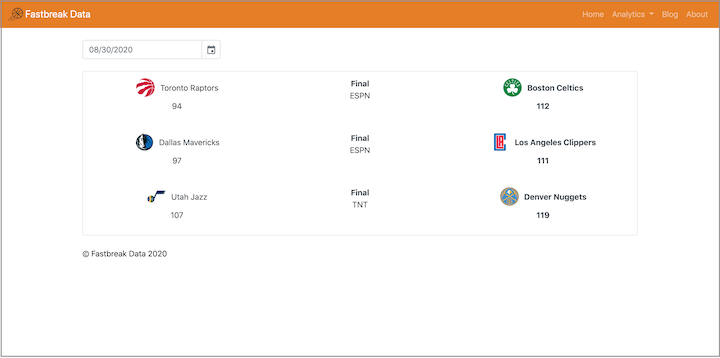

## Udacity Data Scientist Nanodegree

### Capstone Project - Fastbreak Data | NBA Data Dashboard

#### Table of Contents
1. [Overview](#summary)
2. [Analysis](#analysis)
3. [Conclusion](#conclusion)
4. [Data](#data)
5. [Requirements](#requirements)
6. [Installation](#installation)
7. [Credits](#credits)

#### 1. Overview 
Fastbreak Data is a Python Flask app that displays NBA games, box scores, and standings with a blog component attached. The project originated as a Medium blog, which was a space to share data science and basketball insights to a technical audience. Using the learnings from the Udacity Data Scientist Nanodegree, this project has evolved into a web application with Python Flask content from the Software Engineering course. 

This project is available at [fastbreakdata.herokuapp.com](https://fastbreakdata.herokuapp.com)

**Note:** At the time of this writing, only the local application pulls data as the hosted application shows a ReadTimeout error for the API.

#### 2. Analysis 
It was my goal to create a web application and grow Fastbreak Data from a blog to a sports analytics website. In this capacity, I aimed to demonstrate the use of pulling NBA data and showcasing live game scores, data visualizations of team stats, box scores of player stats, and the season's current team standings. The attached images showcase the use of data on this web application.

#### 3. Conclusion 

Sourcing API data and building a Python Flask application to display NBA data proved to be quite the challenge. Not only did it require utilizing Flask, but also ensuring that the other elements of HTML, CSS, and Javascript worked together. On top of that, deploying the app to Heroku and making it available was another challenge in itself. This project was insightful, however, as it enabled me to lay the foundations of an analytics website.

There are areas of improvement for this project, mainly finding a API ReadTimeout workaround to enable the data to be showcased on Heroku. At the time of this writing, this application is available without issue only on a local machine. Other areas of improvement could be a diversification of the data visualizations as well as upgrades to the Javascript datepicker to dynamically change pages upon date selection.

#### 4. Data  
This dataset is sourced from [`nbapy`](https://github.com/jtpavlock/nbapy).

#### 5. Requirements  
1. Python 3.8
2. Flask
3. Nbapy
4. Numpy
5. Pandas
6. Plotly
7. Python-dateutil
8. Pytz
9. Redis
10. Requests
11. Urllib3
12. Werkzeug
13. WTForms

#### 6. Installation 
1. In terminal, ensure that `pip` is installed `sudo apt-get install pip`
2. Navigate to `app` folder
3. Create a virtual environment `python3 -m virtualenv [YOUR ENV NAME]`
4. Install packages `pip install -r requirements.txt`
5. Type `flask run` to launch the application
6. Go to [`http://127.0.0.1:5000/`](http://127.0.0.1:5000/) in a browser URL

#### 7. Credits 
Credits go to the developers of [`nbapy`](https://github.com/jtpavlock/nbapy) and [`nba_py`](https://github.com/seemethere/nba_py) (the former NBA API) as well as Github user [@huyle333](https://github.com/huyle333) for inspiration for this project.