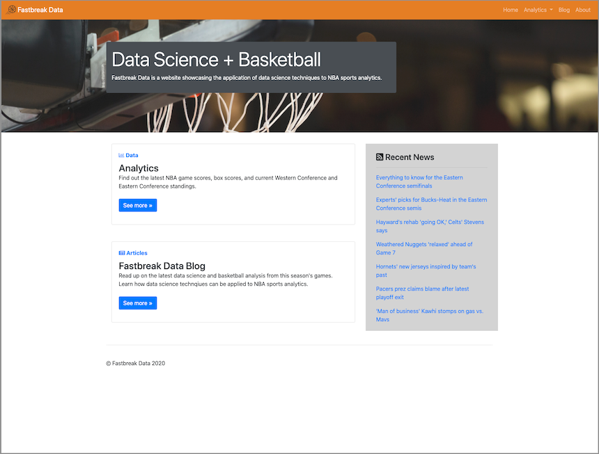
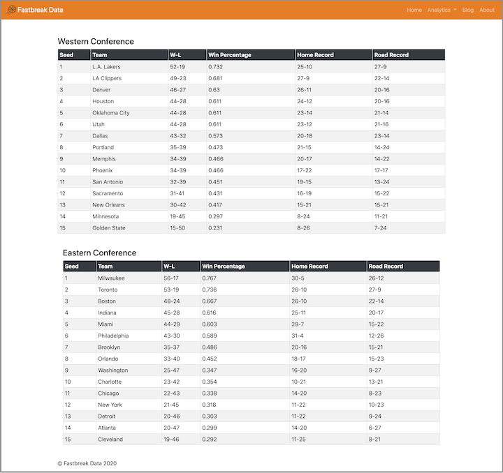

## Udacity Data Scientist Nanodegree

### Capstone Project - Fastbreak Data | NBA Data Dashboard

#### Table of Contents
1. [Overview](#summary)
2. [Project Analysis](#analysis)
3. [Project Conclusion](#conclusion)
4. [Data](#data)
5. [Requirements](#requirements)
5. [Credits](#credits)

#### 1. Overview 
Fastbreak Data is a Python Flask app that displays NBA games, box scores, and standings with a blog component attached. The project originated as a Medium blog, which was a space to share data science and basketball insights to a technical audience. Using the learnings from the Udacity Data Scientist Nanodegree, this project has evolved into a web application with Python Flask content from the Software Engineering course. 

This project is available at [fastbreakdata.herokuapp.com](https://fastbreakdata.herokuapp.com)

#### 2. Project Analysis 
It was my goal to create a web application and grow Fastbreak Data from a blog to a sports analytics website. In this capacity, I aimed to demonstrate the use of pulling NBA data and showcasing live game scores, data visualizations of team stats, box scores of player stats, and the season's current team standings. The attached images showcase the use of data on this web application.

#### 3. Project Conclusion 

Sourcing API data and building a Python Flask application to display NBA data proved to be quite the challenge. Not only did it require utilizing Flask, but also ensuring that the other elements of HTML, CSS, and Javascript worked together. On top of that, deploying the app to Heroku and making it available was another challenge in itself. 

There are areas of improvement for this project, mainly finding a API ReadTimeOut workaround to enable the data to be showcased on the hosted app. At the time of this writing, this application is availble without issue only on a local machine. Other areas of improvement could be a diversification of the data visualizations, as well as upgrades to the Javascript datepicker to dynamically change pages upon date selection.

#### 4. Data  
This dataset is sourced from [`nbapy`](https://github.com/jtpavlock/nbapy).

#### 5. Requirements and Installation 
1. Python 3.8
2. `pip install -r requirements.txt`
3. Run locally `flask run` and by going to [`http://127.0.0.1:5000/`](http://127.0.0.1:5000/) in a browser URL.

#### 6. Credits 
Credits go to the developers of [`nbapy`](https://github.com/jtpavlock/nbapy) and [`nba_py`](https://github.com/seemethere/nba_py) (the former NBA API) as well as Github user [@huyle333](https://github.com/huyle333/bballfast) for inspiration for this project.