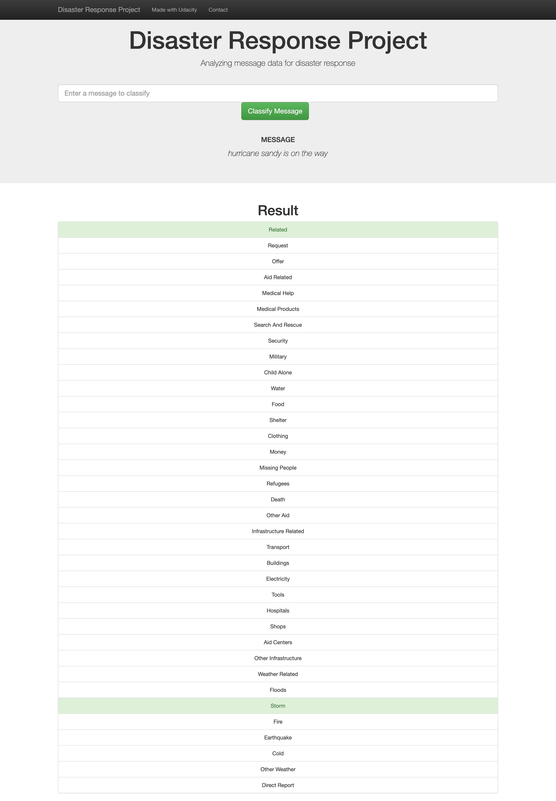
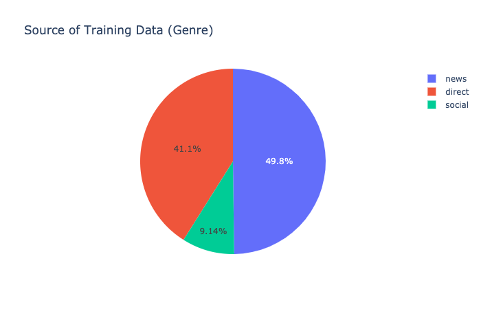
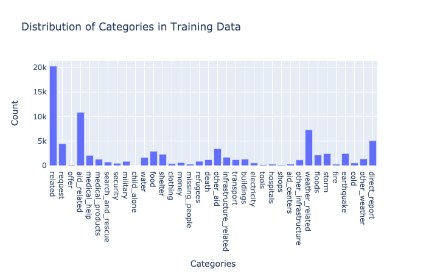

## Udacity Data Scientist Nanodegree

### Project 02 - Disaster Response Pipeline Project

#### Table of Contents
1. [Overview](#summary)
2. [Requirements](#requirements)
3. [Instructions](#instructions)
4. [Project Files](#project_files)
5. [Credits](#credits)

#### 1. Overview 

This project used data provided by [Figure Eight](https://appen.com/) to build a machine learning model to properly classify disaster data. The data set contains real messages created during disaster events. A machine learning pipeline is trained on the data set and categorizes these events. Finally, the following web app allows for users to input a new message to get a classification result in various categories. 

#### 2. Requirements  

- Python3
- Flask
- JobLib
- NLTK
- Numpy
- Pandas
- Plotly
- SQLAlchemy
- SKLearn

#### 3. Instructions 
1. Run the following commands in the project's root directory to set up your database and model.

    - To run ETL pipeline that cleans data and stores in database
        `python data/process_data.py data/disaster_messages.csv data/disaster_categories.csv data/DisasterResponse.db`
    - To run ML pipeline that trains classifier and saves
        `python models/train_classifier.py data/DisasterResponse.db models/classifier.pkl`

2. Run the following command in the app's directory to run your web app.
    `python run.py`

3. Go to http://0.0.0.0:3001/

#### 4. Project Files 
	
	├── app
	│   ├── run.py
	|   ├── showdata.py 
	│   └── templates	
	│       ├── go.html	
	│       └── master.html
	|
	├── data
	│   ├── disaster_categories.csv	
	│   ├── disaster_messages.csv	
	│   ├── DisasterResponse.db	
	│   └── process_data.py		
	|
	├── ipynb
	│   ├── dataviz_preparation.ipynb
	│   ├── etlpipeline_preparation.ipynb
	│   └── mlpipeline_preparation.ipynb	
	|
	├── models
	│   ├── classifier.pkl	
	│   └── train_classifier.py
	|
	├── screenshots
	│   ├── barchart.png
	│   ├── piechart.png	
	│   └── results.png
	|
	├── README.md		
    
#### 5. Screenshots 
##### Classification Results
 
##### Training Data

  

#### 6. Credits 

The data set was provided by [FigureEight](https://appen.com/datasets/combined-disaster-response-data/) and starter code by [Udacity](https://www.udacity.com/).
