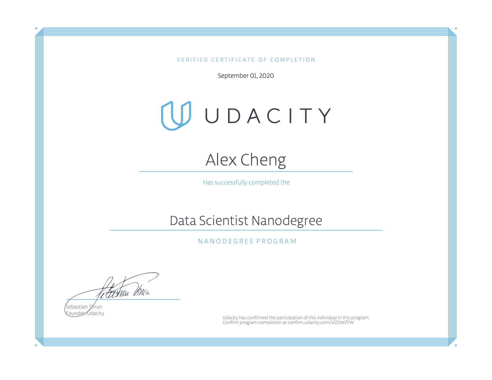

## Udacity Data Scientist Nanodegree

#### Table of Contents
1. [Overview](#summary)
2. [Project 01](#project_1)
3. [Project 02](#project_2)
4. [Project 03](#project_3)
5. [Capstone Project](#capstone)
6. [Notes](#notes)

#### 1. Overview 

The Udacity Data Scientist Nanodegree is an advanced program designed to prepare students for data scientist jobs. The below lists the projects completed. Each project contains a README.md file for more details. 

#### 2. Project 01: Write a  Data Science Blog Post 
A dataset was chosen with three business questions to answer. Analysis of the data and insights were shared in a written blog post to a technical audience.

#### 3. Project 02: Build Pipelines to Classify Messages with Figure Eight 
This project involved building data pipelines to prepare message data provided by Figure Eight from major natural disasters around the world. The machine learning pipelines were then able to categorize emergency text messages based on the need communicated by the sender.

#### 4. Project 03: Design a Recommendation Engine with IBM 
This project involved building a recommendation engine using a dataset provided by IBM Watson to surface content most likely relevant to users of their data platform.

#### 5. Capstone Project: Build a NBA Data Dashboard 
This project involved utilizing Python Flask to source NBA API data to build a data dashboard to analyze game scores, player stats, and team standings. The final web app used a combination of Flask for the web framework, Bootstrap for CSS/HTML, Javascript, Heroku, and data wrangling for the API.

#### 6. Notes 

This folder contains supporting documents and references to content used in this program.
